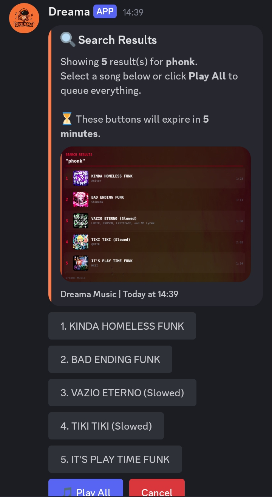
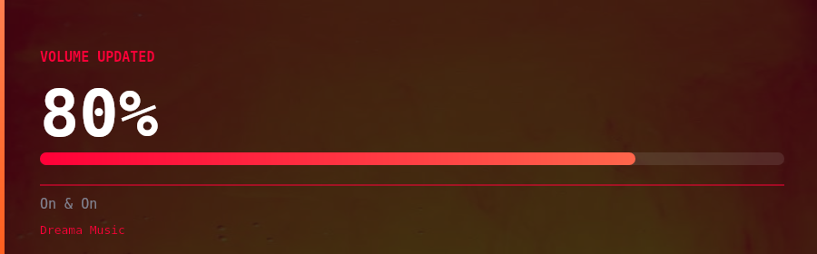

# ✨ Dreama — Discord Music Bot

🎶 A Discord music bot built with [discord.js v14](https://discord.js.org/) and [lavalink-client](https://github.com/Tomato6966/lavalink-client), powered by a Lavalink v4 audio server.

> ‼️ This **code** was close to the documentation of **[lavalink-client](https://tomato6966.github.io/lavalink-client).** Everything is easy to understand. Please always give credits to **@zBlueOrangePie** when using this code.

## 🚀 Features

- **🔍 Supports YouTube, SoundCloud, Spotify, Deezer, Bandcamp, and direct url links**
> ‼️ To accept urls, you must have a running plugin called **[LavaSrc](https://github.com/topi314/LavaSrc)** plugin in your lavalink server.
- **🎛️ Filters**
- **📋 Advanced Queue**
- **🔍 Song Searching**
- **💪 Easy to host**
- **🎶 Music with controllable buttons**
- **✨ Music Cards**
- **🤖 Autoplay/music recommendations**
- **📋 Error Logging And Handling for nonstop music action!**
- **❌ No database needed**

## 🤯 Preview of the image cards!!







---

## ❔ Requirements

- 🟢 **Node.js** v18 or higher
- 🟢 A running **Lavalink v4** server ([setup guide](https://tomato6966.github.io/lavalink-client/home/setup-lavalink))
- 🟢 A **Discord Bot** application with the correct intents enabled

---

## 📙 Installation

Clone the repository and install dependencies:

```bash
npm install
```

---

## 📘 Configuration

Copy the example env file and fill in your values:

```bash
cp .envExample .env
```

> Then open `.env` and configure each field:

```env
TOKEN= # Your Discord bot token
CLIENT_ID= # Your Discord application/client ID
USERNAME= # Your bot's display name

LAVA_HOST= # Hostname or IP of your Lavalink server (e.g. localhost)
LAVA_PORT= # Port your Lavalink server listens on (e.g. 2333)
LAVA_PASS= # Password set in your Lavalink application.yml
LAVA_SECURE= # Set to "true" if your Lavalink server uses HTTPS/WSS, otherwise "false"

FOOTER= # Text shown in the footer of embeds (e.g. Dreama)
```

### ⁉️ Where to find your values

**TOKEN** and **CLIENT_ID** — Go to the [Discord Developer Portal](https://discord.com/developers/applications), open your application, and find the token under **Bot** and the client ID under **General Information**.

**LAVA_HOST / LAVA_PORT / LAVA_PASS / LAVA_SECURE** — These come from your Lavalink server's `application.yml` config. If you are self-hosting, the defaults are usually `localhost`, `2333`, `youshallnotpass`, and `false`.

---

## 🚀 Deploying Slash Commands

Before running the bot for the first time, register the slash commands with Discord: (This is optional only as slash commands will be automatically deployed once you start the index.js file)

This only needs to be run once, or again whenever you add or modify a command.

```bash
node deploy-cmds.js
```

## ‼️ Deleting Slash Commands

> ⁉️ The code already has a configured file that deletes all global slash commands. Use this in your terminal to delete all global slash commands

```bash
node deleteCommands.js
```

---

## 🟢 Running the Bot

```bash
node index.js
```

---

## ‼️ Notes

- The bot requires the **Server Members Intent** and **Message Content Intent** to be enabled in the Discord Developer Portal under your bot's settings.

- Lavalink must be running and reachable before starting the bot, otherwise the node will fail to connect.

- To add a new command, create a `.js` file inside any subfolder of `commands/`. It will be picked up automatically.

## ❔ Developer

- Created and developed by **@zBlueOrangePie**

## ‼️ LICENSE

- **Creative Commons Zero v1.0 Universal**
